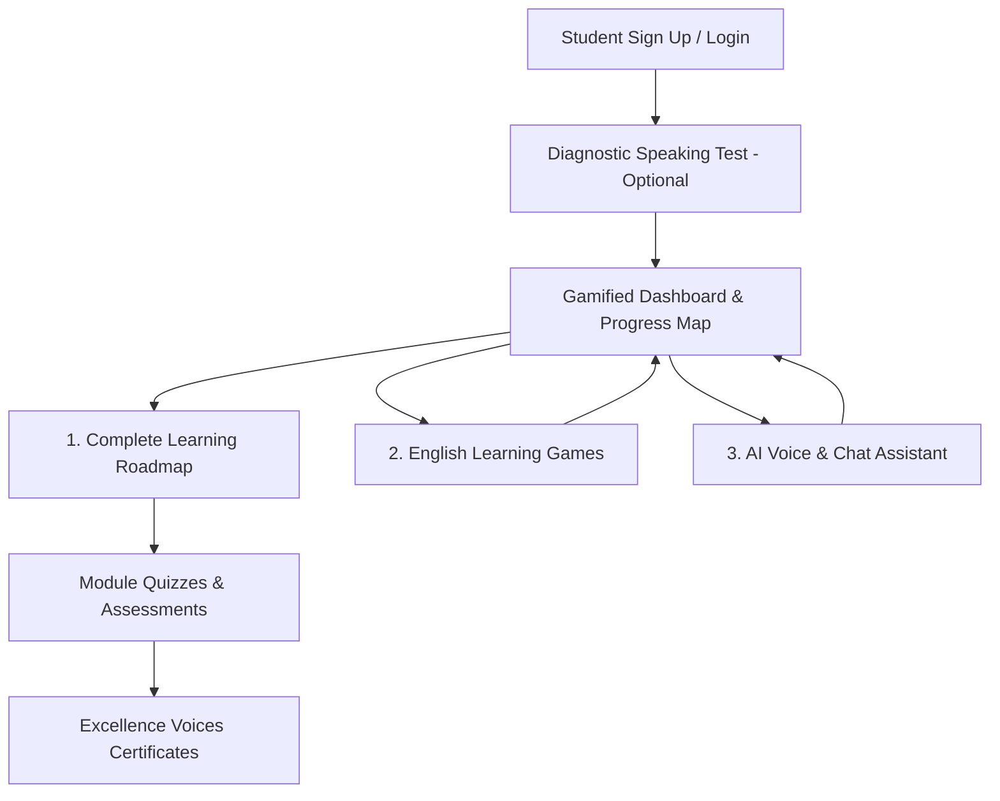

# Excellence Voices Pro: Product Outline & Implementation Plan

Welcome to the product outline and implementation plan for **Excellence Voices Pro** (`pro.excellencevoices.in`). This plan outlines a comprehensive, gamified, AI-powered platform designed to build confidence and fluency in English communication for school students.

---

## 1. Core Platform Architecture & User Journey

The platform is designed to take students from hesitant speakers to confident public communicators through a structured, interactive roadmap.

---

## 2. Platform Modules & Feature Deep-Dive

### Module A: The Gamified Progress Dashboard & Roadmap
A visually stunning, interactive dashboard where students view their learning path as an adventure map (like Duolingo or candy-crush style journey nodes).
* **Daily Streaks & XP (Experience Points):** Incentivizes daily practice.
* **Journey Nodes:** Locked modules that open as the student progress.
* **Achievements & Badges:** "Stage Master," "Vocabulary King/Queen," "Fluency Pro."
* **Milestone Rewards:** Virtual coins that can be redeemed for avatar customization or certificates.
* **Daily Practice Goal Widget:** A visual progress ring indicating completion of the mandatory **15-minute daily practice goal**, along with a Monday-Friday calendar grid tracker. Completing 5 days in a week awards massive XP and sustaining streak multipliers.
* **Forced Weekly WhatsApp Progress Sharing:** At the end of each weekly cycle (e.g., Friday afternoon), the dashboard locks. The student must click two redirect links to share their progress report via WhatsApp Web/App to both their parent and class teacher to release the lock and open next week's speech modules.

### Module B: The English Communication Roadmap
A structured curriculum divided into three milestones, suitable for school standards:
1. **Foundation Level (Phonics & Vocabulary):**
   * Fun pronunciation practice, vocabulary builders, and word-formation games.
2. **Fluency Level (Conversational Skills):**
   * Real-life situational conversations (e.g., talking to a teacher, buying groceries, ordering food).
3. **Advanced Level (Public Speaking & Presentation):**
   * Debate structures, storytelling techniques, body language, and voice modulation tips.

### Module C: Interactive English Games
Web-based interactive games that make learning grammar and speech fun:
* **Word Rush (Vocabulary):** Fast-paced word-association and synonym matching.
* **Grammar Galaxy (Syntax):** Drag-and-drop puzzle game to construct grammatically correct sentences.
* **Sound Matcher (Phonics):** Audio-based listening game where students identify the correct phonetic sound.
* **Speech Pitch (Modulation):** Students read a line with different emotions (Happy, Angry, Excited), and the app visualizes their pitch.

### Module D: AI Voice & Chat Assistant ("VoiceBuddy")
A companion tutor that listens, speaks, and provides instant guidance.
* **Chat Assistance (Text):** Contextual English conversation corrector that points out typos and suggests better ways to frame sentences.
* **AI Voice Assistant (Speech-to-Speech):** A safe, friendly voice room where students can converse with an AI tutor (e.g., "Let's practice ordering food at a restaurant").
* **Instant Speech Feedback:**
  * *Pronunciation Accuracy Check:* Highlighting mispronounced words in red.
  * *Pacing/Speed Meter:* Checking if the student is speaking too fast, too slow, or just right.
  * *Grammar Suggestions:* Post-conversation tip reports on sentence structure improvements.

### Module E: Excellence Voices Certification
* **Milestone Assessments:** Practical voice recording submissions graded automatically by AI + reviewed by Excellence Voices trainers.
* **Digital Certificates:** Custom-designed, print-ready, secure certificates signed by Excellence Voices founders.
* **Shareable Verification Links:** A unique URL (e.g., `excellencevoices.in/verify/CERT-ID`) where schools and parents can verify certificate authenticity.

### Module F: School & Teacher Dashboard
* **Bulk License Management:** Schools can purchase $X$ student licenses, generating invite codes or automatic student account imports.
* **Class Analytics:** Teachers can track weekly usage, average fluency progress, average game scores, and certificate completions across divisions.
* **Active Practice Tracker:** Visual reports showcasing each student's daily time spent. Easily indicators show who has completed their 15-minute/day, 5-days/week target.
* **Assignment Tracker:** Teachers can assign specific speaking tasks, vocabulary lists, or speech exercises as homework.
* **Scorecard Review:** Teachers can listen to audio recordings submitted by students and leave manual feedback or override AI grading.

---

## 3. Technology Stack Recommendation

To build this modern, scalable, and responsive application, we recommend the following stack:

| Component | Technology | Description |
| :--- | :--- | :--- |
| **Frontend** | React (Next.js) or Vite + Vanilla CSS | Provides rapid loading, responsive mobile/tablet layout (crucial for students), and rich glassmorphic aesthetics with custom micro-animations. |
| **Database & Auth** | Firebase (Firestore & Auth) | Fast setup for student accounts, roadmap tracking, high-score leaderboards, and certificate meta-storage. |
| Speech Technology | Web Speech API | Client-side speech-to-text and text-to-speech engine. 100% free and native to modern browsers. |
| **AI Text/Chat Engine** | Gemini Flash / Web Speech synthesis | High-speed response generation for conversations and local synthesis for audio replies. |
| **Deployment** | Vercel / Netlify | Easily connects to the subdomain `pro.excellencevoices.in`. |

---

## 4. Phase-wise Implementation Plan

We propose a phased approach to build a highly polished Minimum Lovable Product (MLP) first:

### Phase 1: MVP Landing Page & Diagnostic Assessment (Week 1-2)
* Beautiful landing page at `pro.excellencevoices.in` introducing the Pro platform.
* An interactive speaking/vocabulary assessment that generates a mini "English Fluency Report" (lead generation tool for schools).

### Phase 2: Core Dashboard & First Game (Week 3-4)
* User account registration and gamified progress roadmap.
* Integration of the first core games: *Word Rush* and *Grammar Galaxy*.

### Phase 3: AI Voice Assistant & Course Roadmap (Week 5-6)
* Launching the first 5 roadmap units.
* Integrating the AI voice chat room with Web Speech API for live interactive speaking scenarios.

### Phase 4: Certification, Teacher Portal & Launch (Week 7-8)
* Auto-generating PDF certificates upon course completion.
* Launching the School & Teacher dashboard with bulk license invites and analytics.
* Live school leaderboards to foster friendly competition between classes.
* Subdomain connection and launch marketing.

---

## Resolved Decisions

> [!NOTE]
> **Confirmed Technical & Product Decisions:**
> 1. **Target Age Group:** Adaptable dynamic UI (simplified, engaging, bright layout for primary school students; sleek, modern, gamified dark-mode dashboard for high school students).
> 2. **AI Voice Technology:** Browser-native **Web Speech API** for both Speech-to-Text (recognition) and Text-to-Speech (synthesis) to guarantee zero API consumption costs.
> 3. **Payments & Activation:** Hybrid model. Individual student access is purchased online via a payment gateway (UPI/Razorpay/Stripe). School bulk accounts are handled offline, with admins issuing license activation keys to schools.

## User Action Required

> [!IMPORTANT]
> **Subdomain Setup:** Do you have access to your domain provider (e.g., GoDaddy, Hostinger) to create a CNAME record pointing `pro.excellencevoices.in` to our hosting server when ready?
